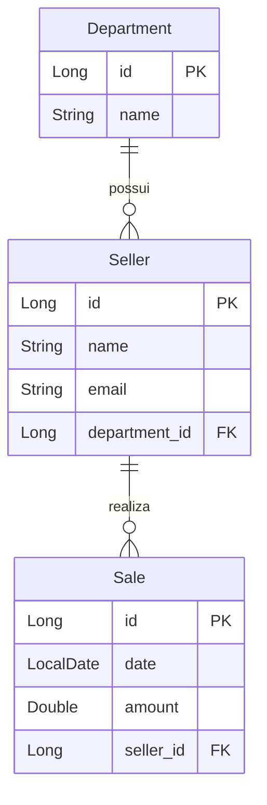

# Desafio DevSuperior - Consulta de Vendas

[](https://openjdk.org/projects/jdk/17/)
[](https://spring.io/projects/spring-boot)
[](https://hibernate.org/)
[](https://www.h2database.com/)
[](https://github.com/Jacques-Trevia/desafio-consulta-vendas/blob/main/LICENSE)

## 📖 Sobre o Projeto

Este repositório contém a resolução de um **desafio prático** do curso **Java Spring Professional** da DevSuperior. O objetivo é construir uma API REST para **consulta de vendas**, consolidando conceitos fundamentais de:

- **Consultas SQL personalizadas** com Spring Data JPA
- **Projeções** (Projections) para otimizar consultas
- **Joins entre entidades** (Venda, Vendedor, Departamento)
- **Agregação e sumarização** de dados (totais por período)
- **Tratamento de datas** com parâmetros de busca

O desafio simula um sistema onde é possível consultar vendas realizadas por vendedores, com filtros por período e agrupamentos por departamento.

## 🎯 Objetivo do Desafio

Aprender na prática como:
- Criar consultas complexas com Spring Data JPA usando `@Query`
- Utilizar **JPQL** (Java Persistence Query Language) e **SQL nativo**
- Implementar **projeções** para retornar apenas os dados necessários
- Trabalhar com **parâmetros de data** em consultas
- Agrupar e sumarizar dados (soma de vendas por vendedor/departamento)

## ✨ Funcionalidades

- **Consulta de vendas por período**: Buscar vendas entre datas inicial e final
- **Sumário de vendas por vendedor**: Total vendido por cada vendedor em um período
- **Sumário de vendas por departamento**: Total vendido por departamento
- **Busca de vendas com informações do vendedor e departamento** (join)
- **Tratamento de datas** com `LocalDate` e formatação

## 🚀 Tecnologias Utilizadas

- **Java 17**: Linguagem de programação.
- **Spring Boot 2.7.x**: Framework principal.
- **Spring Data JPA**: Abstração para acesso a dados.
- **Hibernate**: Implementação do JPA.
- **H2 Database**: Banco de dados em memória para desenvolvimento e testes.
- **Maven**: Gerenciador de dependências.

## 📁 Estrutura do Projeto
```
src/
├── main/
│ ├── java/com/jacques/desafioconsultavendas/
│ │ ├── DesafioConsultaVendasApplication.java # Classe principal
│ │ ├── entities/ # Entidades JPA
│ │ │ ├── Sale.java # Venda (data, valor, vendedor)
│ │ │ ├── Seller.java # Vendedor (nome, email, departamento)
│ │ │ └── Department.java # Departamento (nome)
│ │ ├── repositories/ # Interfaces Spring Data
│ │ │ ├── SaleRepository.java # Consultas personalizadas
│ │ │ ├── SellerRepository.java
│ │ │ └── DepartmentRepository.java
│ │ ├── dto/ # Objetos de transferência
│ │ │ ├── SaleSummaryDTO.java # Resumo de venda
│ │ │ └── SellerSummaryDTO.java # Resumo por vendedor
│ │ ├── projections/ # Projeções (opcional)
│ │ │ └── SaleProjection.java
│ │ └── resources/ # Arquivos de configuração
│ └── resources/
│ ├── application.properties # Configuração do H2 e JPA
│ └── import.sql # Dados de teste iniciais
└── test/ # Testes unitários
```

## 🗺️ Modelo de Domínio


Relacionamentos:

Department → Seller: OneToMany (um departamento pode ter vários vendedores)

Seller → Sale: OneToMany (um vendedor pode realizar várias vendas)

Sale → Seller: ManyToOne (cada venda pertence a um vendedor)

## ▶️ Como Executar o Projeto
Pré-requisitos
JDK 17 ou superior

Maven (ou utilizar o wrapper ./mvnw)

Passos
Clone o repositório:

bash
```
git clone https://github.com/Jacques-Trevia/desafio-consulta-vendas.git
cd desafio-consulta-vendas
```
Execute o projeto:

bash
```
./mvnw spring-boot:run
````
A API estará disponível em http://localhost:8080.

Acesse o console do H2 (opcional):
```
URL: http://localhost:8080/h2-console

JDBC URL: jdbc:h2:mem:testdb

Usuário: sa

Senha: (em branco)
```

## 🔌 Exemplos de Consultas (Repository)
1. Buscar vendas entre duas datas
```
public interface SaleRepository extends JpaRepository<Sale, Long> {
    
    @Query("SELECT s FROM Sale s WHERE s.date BETWEEN :minDate AND :maxDate")
    List<Sale> findSalesBetweenDates(@Param("minDate") LocalDate minDate, 
                                      @Param("maxDate") LocalDate maxDate);
}
```
2. Sumário de vendas por vendedor (com projeção)
```
public interface SaleRepository extends JpaRepository<Sale, Long> {
    
    @Query("SELECT new com.jacques.desafioconsultavendas.dto.SellerSummaryDTO(" +
           "   s.seller.name, SUM(s.amount)) " +
           "FROM Sale s " +
           "WHERE s.date BETWEEN :minDate AND :maxDate " +
           "GROUP BY s.seller")
    List<SellerSummaryDTO> sumSalesBySeller(@Param("minDate") LocalDate minDate,
                                             @Param("maxDate") LocalDate maxDate);
}
```
3. Sumário de vendas por departamento
```
public interface SaleRepository extends JpaRepository<Sale, Long> {
    
    @Query("SELECT new com.jacques.desafioconsultavendas.dto.DepartmentSummaryDTO(" +
           "   s.seller.department.name, SUM(s.amount)) " +
           "FROM Sale s " +
           "WHERE s.date BETWEEN :minDate AND :maxDate " +
           "GROUP BY s.seller.department")
    List<DepartmentSummaryDTO> sumSalesByDepartment(@Param("minDate") LocalDate minDate,
                                                      @Param("maxDate") LocalDate maxDate);
}
```
## 📊 Exemplo de Uso
Dados de Exemplo
```
Departamento	Vendedor	Data da Venda	Valor
Electronics	João	2025-02-01	1500.00
Electronics	João	2025-02-15	2000.00
Books	Maria	2025-02-10	800.00
Books	Maria	2025-02-20	1200.00
Consulta: Vendas entre 2025-02-01 e 2025-02-20
```
Resultado por Vendedor:

João: R$ 3500,00

Maria: R$ 2000,00

Resultado por Departamento:

Electronics: R$ 3500,00

Books: R$ 2000,00

## 📦 População Inicial de Dados
O arquivo import.sql insere dados de exemplo automaticamente:

sql
```
INSERT INTO tb_department (name) VALUES ('Electronics'), ('Books'), ('Clothing');
```
```
INSERT INTO tb_seller (name, email, department_id) VALUES 
('João Silva', 'joao@email.com', 1),
('Maria Santos', 'maria@email.com', 2);
```
```
INSERT INTO tb_sale (date, amount, seller_id) VALUES 
('2025-02-01', 1500.00, 1),
('2025-02-15', 2000.00, 1),
('2025-02-10', 800.00, 2);
```
## 📚 Aprendizados
Este desafio permitiu praticar:

✅ Consultas personalizadas com @Query (JPQL e SQL nativo)

✅ Uso de projeções e DTOs para otimizar respostas

✅ Joins entre entidades (Sale → Seller → Department)

✅ Agregações (SUM, GROUP BY) com Spring Data JPA

✅ Parâmetros de data (LocalDate) em consultas

✅ Separação de responsabilidades (Repository + DTO)

## 📜 Licença

Este projeto é parte do curso da **DevSuperior** e tem propósito educacional.

---

## 👨‍💻 Autor

**Jacques Araujo Trevia Filho**

[](https://www.linkedin.com/in/jacques-trevia)
[](https://github.com/Jacques-Trevia)
